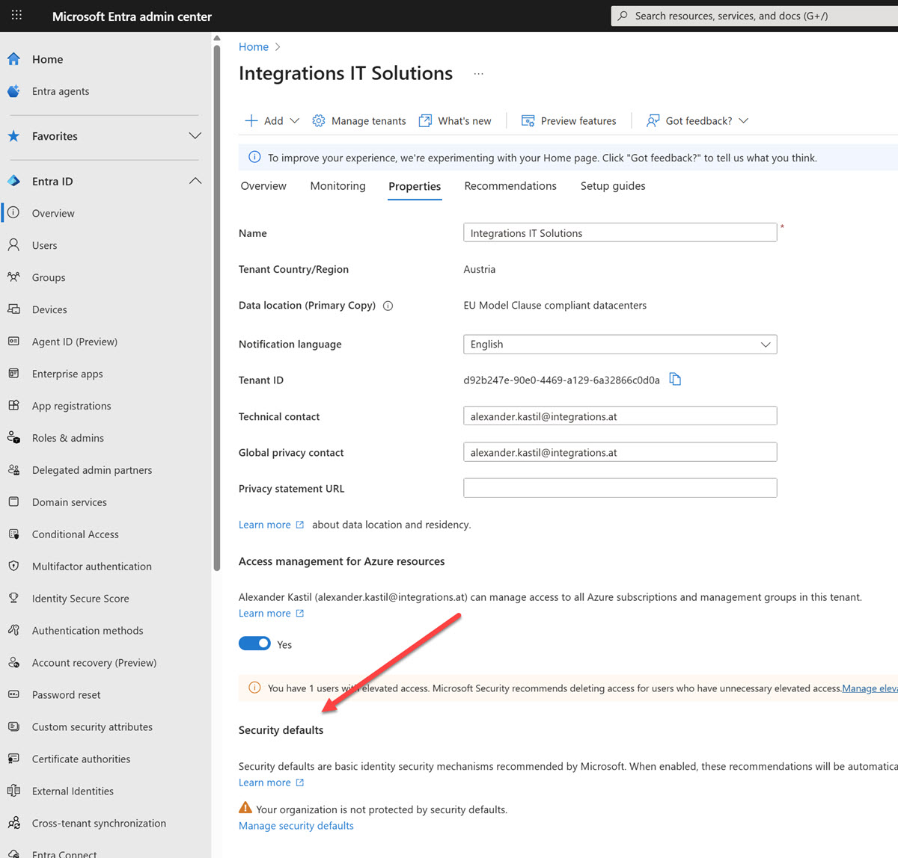

# Prepare Env

## Get informed about the Microsoft 365 Copilot

[Microsoft 365 Copilot](https://adoption.microsoft.com/en-us/Copilot/)

[Set up Microsoft 365 Copilot admin guide](https://learn.microsoft.com/en-us/copilot/microsoft-365/microsoft-365-copilot-setup)

## Deploy / Update the Microsoft 365 app using Current Channel

[Plan your enterprise deployment of Microsoft 365 Apps](https://learn.microsoft.com/en-us/microsoft-365-apps/deploy/plan-microsoft-365-apps#step-3---choose-your-update-channels)

[Update Channels](https://learn.microsoft.com/en-us/microsoft-365-apps/updates/overview-update-channels#current-channel-overview?azure-portal=true)

[Office Customization Tool](https://config.office.com/deploymentsettings)

- Go to the Microsoft 365 Admin Center
- Navigate to: **Settings** > [**Org settings**](https://admin.cloud.microsoft/?#/Settings/Services)
- Under the Services tab, select Microsoft 365 installation options
- Choose `Current Channel` from the list of update channels.

## Modify default settings to ensure the Conditional Access policy can be enabled

[Security defaults in Microsoft Entra ID](https://learn.microsoft.com/en-us/entra/fundamentals/security-defaults#enabling-security-defaults)

- Sign in to the Microsoft Entra admin center as a Security Administrator.
- Go to Overview > Properties.
- Click `Manage security defaults` at the bottom of the page.

  
