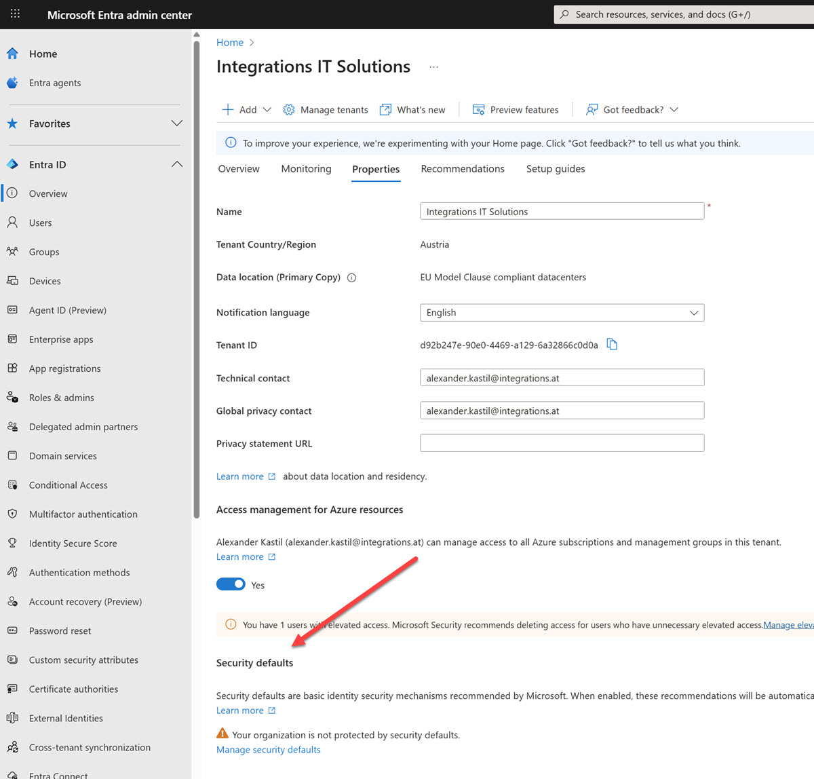

# Prepare Env

Hands-On Demo: [Set the update channel and swap security defaults for Conditional Access](demo-tenant-readiness-baseline.md)

## Get informed about the Microsoft 365 Copilot

[Microsoft 365 Copilot](https://adoption.microsoft.com/en-us/Copilot/)

[Set up Microsoft 365 Copilot admin guide](https://learn.microsoft.com/en-us/copilot/microsoft-365/microsoft-365-copilot-setup)

## Deploy / Update the Microsoft 365 app using Current Channel

[Plan your enterprise deployment of Microsoft 365 Apps](https://learn.microsoft.com/en-us/microsoft-365-apps/deploy/plan-microsoft-365-apps#step-3---choose-your-update-channels)

[Update Channels](https://learn.microsoft.com/en-us/microsoft-365-apps/updates/overview-update-channels#current-channel-overview?azure-portal=true)

[Office Customization Tool](https://config.office.com/deploymentsettings)

- Go to the [Microsoft 365 Admin Center](https://admin.microsoft.com)
- Navigate to: **Settings** > [**Org settings**](https://admin.cloud.microsoft/?#/Settings/Services)
- Under the Services tab, select Microsoft 365 installation options
- Choose `Current Channel` from the list of update channels.

## Modify default settings to ensure the Conditional Access policy can be enabled

[Security defaults in Microsoft Entra ID](https://learn.microsoft.com/en-us/entra/fundamentals/security-defaults)

Security defaults and Conditional Access are mutually exclusive. To use Conditional Access policies, disable security defaults first, then immediately enable replacement policies so the tenant is not left unprotected.

- Sign in to the [Microsoft Entra admin center](https://entra.microsoft.com) as at least a **Conditional Access Administrator**.
- Go to **Entra ID** > **Overview** > **Properties**.
- Select `Manage security defaults` at the bottom of the page.
- Set **Security defaults** to `Disabled (not recommended)` and save.

  

Microsoft-managed Conditional Access policies reproduce the same protections that security defaults provided: block legacy authentication, require MFA for Azure management, require MFA for admins, and require MFA for all users. Conditional Access requires at least Microsoft Entra ID P1.

Two recent changes to security defaults are worth calling out in the classroom, because both can break a demo tenant:

- Security defaults now block **device code flow**. All new Microsoft Entra tenants created from July 1, 2026 enforce this. Sign-in flows that rely on device code, including some CLI and agent development scenarios, fail while security defaults are on.
- The 14-day MFA registration grace period was removed on July 29, 2024. New tenants get a 24-hour grace period at creation only.
